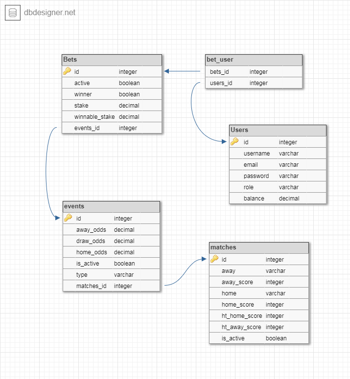

# EasyBet - Online sportfogadó alkalmazás
---
## Az alkalmazás rövid leírása
Az oldalra az adminok feltölthetnek sport mérkőzéseket és hozzájuk kapcsolódó fogadási eseményeket, melyekre a regisztrált felhasználók virtuális pénzzel tudnak fogadni. Az adott meccs vegeztélvel az admin lezárja a hozzá létrehozott eseményeket, így az arra vonatkozó fogadások kiértékelődnek.

## Tartalomjegyzék
+ Funkcionális követelmények
+ Adatbázis diagram
+ Szerepkörök
+ Könyvtárstruktúra (backend)
+ Fejlesztői környezet
+ Végpont tervek és leírások
+ Végpont szekvenciadiagram

## Funkcionális követelmények
Az oldal célja, hogy magas színvonalú játékot és vonzó fogadásokat kínáljon az ügyfelek számára a világ minden tájáról.
+ Ajánlatok böngészése
+ Regisztráció
+ Bejelentkezés, kijelentkezés
+ Meccs kiírása
+ Meccs módosítása, törlése
+ Esemény kiírása
+ Esemény lezárása, kiértékelése
+ Esemény módosítása, törlése
+ Eseményre fogadás

## Adatbázis diagram

## Szerepkörök
| Szereplő |  |
| ------ | ----------- |
| Látogató   | Böngészheti a kiírt eseményeket. |
| Felhasználó | Fogadhat a kiírt eseményekre. Kiértékelés után jóváírhatják a nyereményt, vagy levonhatják a tétet az egyenlegéről |
| Admin    | Kiírhat, lezárhat meccseket, eseményeket, illetve törtölheti és módosíthatja is azokat. |

## Könyvtárstruktúra (backend)
+ EasybetApplication.java
+ api
    + BetApiController.java
    + EventApiController.java
    + MatchApiController.java
    + UserApiController.java
+ config
    + AuthInterceptor.java
+ controller
    + BetController.java
    + EventController.java
    + MatchController.java
    + UserController.java
+ model
    + BaseEntity.java
    + Bet.java
    + Event.java
    + Match.java
    + User.java
+ repository
    + BetRepository.java
    + EventRepository.java
    + MatchRepository.java
    + UserRepository.java
+ service
    + BetService.java
    + EventService.java
    + exceptions
    + MatchService.java
    + UserService.java
    + annotations
        + Role.java
    + exceptions
        + Error1.java
        + UserNotValidException.java
+ utility
    + Response.java

## Fejlesztői környezet
+ git verziókezelő telepítése
+ Projekt klónozása lokális gépre: git clone https://github.com/SlimSider/app-dev.git
+ Tetszőleges fejlesztő környezet
+ Command line - 1 : mvnw spring-boot:run
+ Command line - 2 : cd frontend | npm start
+ localhost:4200 böngészőben

## Végpont tervek és leírások
coming soon

## Végpont szekvenciadiagram
coming soon
